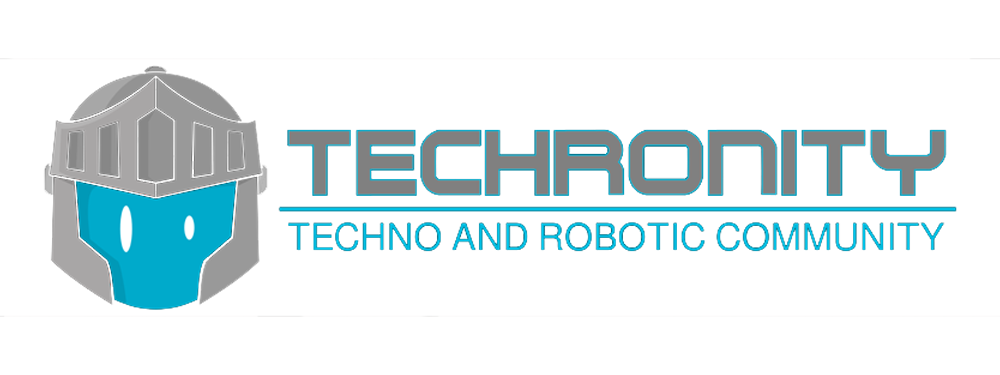

# Modul Kelompok Studi Techronity

## Introduction Study Club Techronity
Study Club Techronity merupakan study club yang membahas mengenai penggunaan internet dan dimensi masyarakat yang dibenamkan pada benda/perangkat/obyek di sekitar. Diharapkan dengan adanya study club ini anggota komunitas mampu mengaplikasikan IoT dengan santun, praktis, dan komprehensif.

Perkembangan teknologi berjalan cukup pesat, tak terkecuali dengan munculnya era industri 4.0 atau yang dikenal dengan internet of things (IoT). Pada topik ini akan dibahas lebih lanjut mengenai pengenalan dan pengantar tentang Industri 4.0, pengertian IoT, IoT dalam masyarakat, Etika IoT dan kekuatan media sosial.

## Tujuan Study Club Techronity
Stucy Club ini bertujuan untuk memfasilitasi peserta study club dengan sikap, keterampilan dan pengetahuan yang dipersyaratkan pada kegiatan pembelajaran. Sikap, pengetahuan dan keterampilan tersebut merupakan kompetensi-kompetensi profesional yang mengacu pada Kerangka Kualifikasi Nasional Indonesia. Sehingga setelah mengikuti pembelajaran ini peserta diharapkan dapat memahami standar berdasarkan ISO, pemrograman Z 80.

## Motto untuk Study Club Techronity

### "Inspire, Innovate, Empower"

Motto ini mencerminkan semangat dan tujuan dari Study Club Techronity. Berikut adalah penjelasan singkat dari setiap kata kunci dalam motto tersebut:

1. Inspire (Menginspirasi):
Kami bertujuan untuk menjadi sumber inspirasi bagi anggota Study Club Techronity dengan menyediakan lingkungan yang kreatif, mendukung, dan berbagi pengetahuan serta ide-ide inovatif. Kami ingin mendorong anggota untuk bermimpi besar dan melampaui batasan-batasan yang ada.

2. Innovate (Berinovasi):
Kami mendorong anggota untuk berinovasi dengan menciptakan solusi teknologi yang kreatif dan berdampak. Kami percaya bahwa melalui pemikiran inovatif dan eksplorasi ide-ide baru, kita dapat memberikan kontribusi yang berarti dalam memecahkan masalah dan meningkatkan kehidupan sehari-hari.

3. Empower (Memberdayakan):
Kami berkomitmen untuk memberdayakan anggota Study Club Techronity dengan pengetahuan, keterampilan, dan sumber daya yang mereka butuhkan untuk meraih kesuksesan dalam bidang teknologi. Kami ingin menjadi jembatan yang membantu anggota mengembangkan potensi mereka, memperluas jaringan, dan meraih kesuksesan pribadi dan profesional.

Dengan motto "Inspire, Innovate, Empower", kami berharap dapat menciptakan lingkungan yang dinamis, inspiratif, dan kolaboratif di Study Club Techronity, dan mendorong anggota untuk menjadi pemimpin masa depan dalam bidang teknologi dengan solusi inovatif dan berdampak positif.

## Visi dan Misi
### Visi
Menjadi komunitas Study Club Techronity yang menjadi pusat pembelajaran, kolaborasi, dan inovasi dalam bidang pengembangan dan penerapan teknologi menggunakan Arduino. Visi kami adalah mendorong pertumbuhan pengetahuan dan keterampilan anggota kami dalam mempelajari, menguasai, dan menciptakan solusi teknologi berbasis Arduino yang inovatif.

### Misi
1. Memberikan platform pembelajaran yang interaktif dan terstruktur bagi anggota Study Club Techronity untuk memperluas pengetahuan dan pemahaman mereka tentang Arduino dan pengembangan teknologi terkait.
2. Mendorong kolaborasi dan pertukaran pengetahuan antara anggota dengan mengadakan diskusi, presentasi, dan proyek bersama yang melibatkan penggunaan Arduino.
3. Membantu anggota Study Club Techronity dalam memperoleh keterampilan teknis yang diperlukan untuk mengembangkan proyek-proyek Arduino yang inovatif dan berdampak.
4. Mengadakan workshop, pelatihan, dan kegiatan belajar lainnya untuk meningkatkan pemahaman dan penerapan konsep-konsep teknis yang berkaitan dengan Arduino.
5. Membangun kemitraan dengan organisasi dan komunitas terkait untuk mengadakan acara, kompetisi, atau proyek yang berfokus pada penggunaan Arduino dalam solusi teknologi yang kreatif dan bermanfaat.
6. Menyediakan sumber daya dan dukungan kepada anggota dalam mengatasi tantangan dan hambatan yang terkait dengan pengembangan proyek Arduino mereka.
7. Mendorong inovasi dan kreativitas anggota Study Club Techronity untuk menghasilkan solusi teknologi yang dapat meningkatkan kehidupan sehari-hari dan memberikan manfaat positif bagi masyarakat.

Dengan visi dan misi ini, kami bertujuan untuk menciptakan lingkungan yang inspiratif dan mendukung bagi anggota Study Club Techronity untuk tumbuh dan berkembang dalam bidang teknologi Arduino, serta memberikan kontribusi nyata dalam masyarakat melalui solusi teknologi yang inovatif.

## Roadmap Kegiatan Pembelajaran
1. [Menginstal Program Arduino UNO](Materi/Modul%20Arduino-10-19.pdf)
2. [Program LED Berkedip](Materi/Modul%20Arduino-20-26.pdf)
3. [Program LED Berderet](Materi/Modul%20Arduino-27-30.pdf)
4. [Program Traffict Light](Materi/Modul%20Arduino-31-37.pdf)
5. [Menyalakan LED Dengan Tombol](Materi/Modul%20Arduino-38-43.pdf)
6. [Menyalakan LED Dengan Trimpot](Materi/Modul%20Arduino-44-48.pdf)
7. [Nada Suara Musik Dengan Arduino](Materi/Modul%20Arduino-49-55.pdf)
8. [LCD dan Sensor Suhu](Materi/Modul%20Arduino-56-65.pdf)
9. [Program Menyalakan LED Dengan Address Decoder](Materi/Modul%20Arduino-66-74.pdf)
10. [Menentukan Hasil Kuadrat Dari Suatu Bilangan Melalui Buffer Memori](Materi/Modul%20Arduino-75-79.pdf)
11. [Tampilan Karakter dan Karakter Berkedip](Materi/Modul%20Arduino-80-87.pdf)

## Documentation
- [Arduino Documentation](https://docs.arduino.cc)
- [Arduino Reference](https://www.arduino.cc/reference/en/)

## Authors
- [Al-Ustadz Shofin](https://github.com/)
- [Al-Ustadz Aziz Musthafa](https://github.com/)
- [Al-Ustadz Oddy Virgantara Putra](https://github.com/virgantara)
- [Imam Fauzi An-Nur]()
- [Afiki]()
- [Muqoddam Husni Wijaya]()
- [Khairul Munzilin Al-Kahfi]()
- [Yudhatama Gusdi Rahmatullah](https://github.com/yudhatamarahmatullah123)

## Contributors
- [Yudhatama Gusdi Rahmatullah](https://github.com/yudhatamarahmatullah123)

## Special Thanks
- Allah Subhanahu Wa Ta'ala.
- Prophet Muhammad Sallahu Alaihi Wa As-Salam.
- My Parents
- All of Author

###### Selamat Belajar ✍🏼
